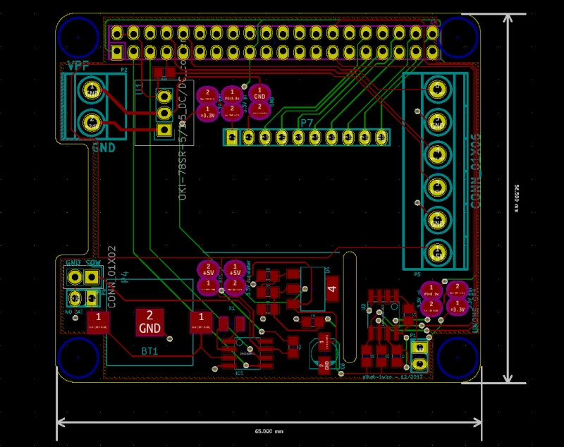
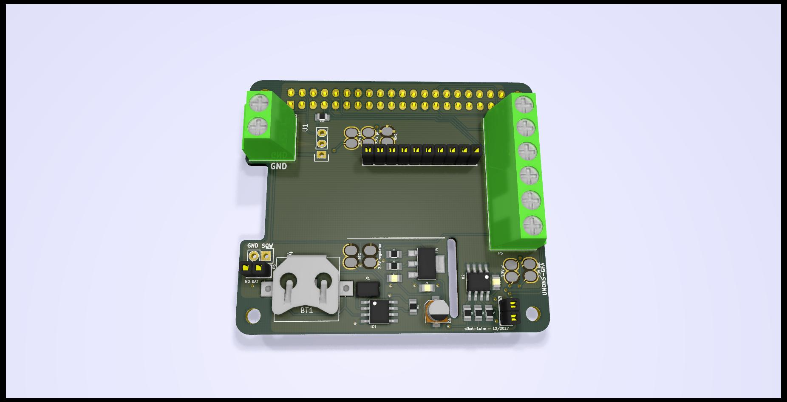

# Raspberry Pi Hat 1-Wire #

This project is based on Raspberry Pi Hat template. 
It has been modified to provide
ready-to-use 1-wire connection.

# Features

* larger footprints for resistors and capacitors, easier to solder (0805 imperial packages)
* add serial connection, battery-backed clock, 1-wire connector

## PCB layout

## 3D view

